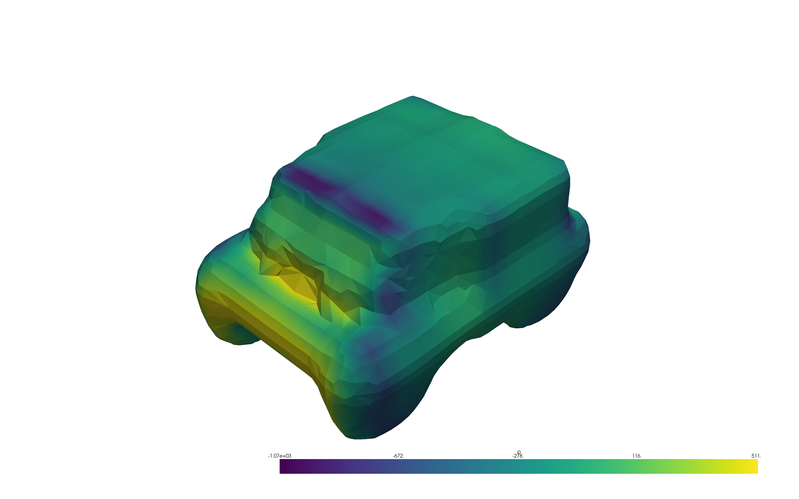
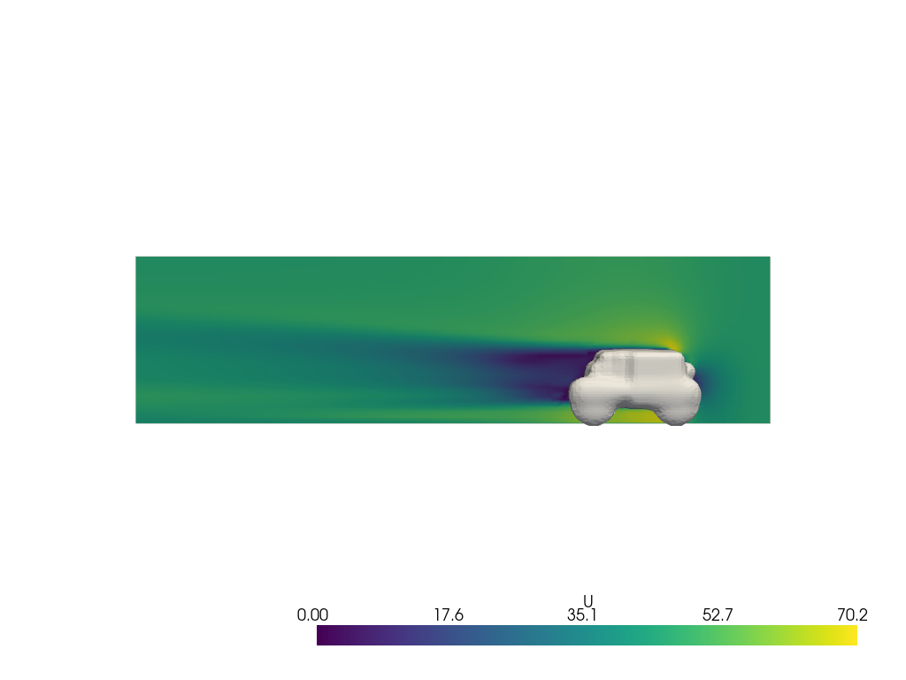

## Wind Tunnel scenario

In the [previous section](/docs/2_TEMPLATING.md), we learned how to change
simulation files on the fly and run simulations using the templating mechanism
provided by **Inductiva API**. By the end, we ran several simulations with
different airflow velocities from the same template directory. However, there was
still a lot of complexity in the code, which could be a source of errors.

At this point, we have all the tools necessary to create a custom **wind tunnel**
scenario within a Python class. This scenario encapsulates the rendering mechanism
and provides users with a simple interface to configure and run simulations.

Let's start building our **wind tunnel** scenario to test the aerodynamics of different
vehicles under different airflows.

### Modeling the Wind Tunnel

The **wind tunnel** simulations performed so far are based on a simple model of
a wind tunnel, where we assume that it is a rectangular box with variable
dimensions in `x, y, z` directions and with air flowing from left to right on
the $x$-axis at a given fixed speed.

These characteristics are encapsulated in the following Python data
class (see `lib/models.py` for extra detail on how to handle argument
verification).

``` python
from dataclasses import dataclass, asdict
from typing import List

@dataclass
class WindTunnel:
    """Wind tunnel model.
    
    Attributes:
        flow_velocity - a tuple with three values (v_x, v_y, v_z).
        x_min, x_max - floats with the minimum and maximum values of the x-axis.
        y_min, y_max - floats with the minimum and maximum values of the y-axis.
        z_min, z_max - floats with the minimum and maximum values of the z-axis.
    """

    flow_velocity: Tuple[float, float, float] = (30, 0, 0)
    x_min: float = -5
    x_max: float = 15
    y_min: float = -5
    y_max: float = 5
    z_min: float = 0
    z_max: float = 8

    def to_dict(self):
        """Converts the object to a dictionary."""
        return asdict(self)
```

A specific virtual `WindTunnel`` configuration is created as follows:

``` python
wind_tunnel = WindTunnel(flow_velocity=(45, 0, 0), 
                         x_min=-2, x_max=10, y_min=-4, y_max=4, z_min=0, z_max=8)
```

These parameters are tagged in the template files `0/include/initialConditions.jinja`
and in the `system/blockMeshDict.jinja` present in the template directory `lib/templates`,
respectively. The latter looks as follows:

```txt
vertices
(
    ({{ x_min }} {{ y_min }} {{ z_min }})
    ({{ x_max }} {{ y_min }} {{ z_min }})
    ({{ x_max }} {{ y_max }} {{ z_min }})
    ({{ x_min }} {{ y_max }} {{ z_min }})
    ({{ x_min }} {{ y_min }} {{ z_max }})
    ({{ x_max }} {{ y_min }} {{ z_max }})
    ({{ x_max }} {{ y_max }} {{ z_max }})
    ({{ x_min }} {{ y_max }} {{ z_max }})
);
```

### Simulation Configuration

The physics of air flowing inside the wind tunnel is fixed. Based on the template
files, the **wind tunnel** we are building considers air to be an incompressible
fluid and the goal is to find the steady state of the system.

With this in mind, most of the simulation configuration is fixed. As we have seen,
in [example B of the previous tutorial](/docs/2_TEMPLATING.md#example-b), the only
modifiable aspects are the meshing resolution, which affects the quality of the
simulation results, and the number of iterations the solver performs until
it stops. We use the tags `{{ resolution }}` and `{{ num_iterations }}` in the
template files to configure these parameters.

As above, we create a data class named `SimulationParameters` to be a placeholder
for the parameters specific to the simulation. With it, users can test different
simulation configurations using the same `WindTunnel` and vehicle.

```python

@dataclass
class SimulationParameters:
    """Simulation Parameters."""

    num_iterations: float = 100
    resolution: int = 2

    def to_dict(self):
        return asdict(self)
```

An instance of the `SimulationParameters` is created as follows:

```python
sim_params = SimulationParameters(num_iterations=100, resolution=2)
```

#### WindTunnel Scenario

The final step is the creation of the `WindTunnelScenario` class. The starting 
point is [example B of the previous tutorial](/docs/2_TEMPLATING.md#example-b),
where the template directory `lib/templates` is used to configure the simulation,
now, from the parameters within the `WindTunnel` and `SimulationParameters`,
and the vehicle to be tested.

The class encapsulates the commands to be executed, the rendering of the
template files and the deployment of the simulation. The following snippet shows
the implementation of the `WindTunnelScenario` class:

```python
import inductiva
from inductiva import mixins, resources, simulators

class WindTunnelScenario(mixins.FileManager):
    """WindTunnel scenario."""

    SCENARIO_DIR = "wind_tunnel_input"
    SCENARIO_TEMPLATE_DIR = "lib/templates"

    def __init__(self,
                 wind_tunnel: WindTunnel):
        """Initializes the `WindTunnel` conditions."""

        self.wind_tunnel = wind_tunnel

    def get_commands(self):
        """Returns the commands to be executed in the simulation."""
        commands = [
            "runApplication surfaceFeatures",
            "runApplication blockMesh",
            "runApplication decomposePar -copyZero",
            "runParallel snappyHexMesh -overwrite",
            "runParallel potentialFoam",
            "runParallel simpleFoam",
            "runApplication reconstructParMesh -constant",
            "runApplication reconstructPar -latestTime",
        ]

        return commands

    def simulate(self,
                 object_path: str,
                 sim_params: SimulationParameters,
                 on: Optional[resources.MachineGroup] = None,
                ):
        """Simulates the wind tunnel scenario asynchronously.

        Args:
            object_path: Path to object inserted in the wind tunnel.
            sim_params: Simulation-specific configuration parameters.
            on: The machine group to use for the simulation.
        """

        self.set_root_dir(self.SCENARIO_DIR)
        # add dir first to create the input directory structure from templates
        self.add_dir(self.SCENARIO_TEMPLATE_DIR, **sim_params.to_dict(),
                     **self.wind_tunnel.to_dict())
        # add the vehicle file into the OpenFOAM specific directory
        self.add_file(object_path, "constant/triSurface/object.obj")


        task = simulators.OpenFOAM().run(
            input_dir=self.get_root_dir(),
            on=on,
            commands=self.get_commands())

        return task
```

The `WindTunnelScenario` inherits from `FileManager` all the file
management and rendering tools previously discussed. Then, we set a method
to return the commands to be executed in the simulation.

Finally, the templating logic and simulation deployment are implemented in the
`simulate` method. We initialize an instance of the scenario with just a model
of the `WindTunnel` and then pass the vehicle file and a `SimulationParameters`
object as arguments to the `simulate` method. This is merely a design choice,
where the reasoning follows that the wind tunnel is invariant between different
simulation runs, but different vehicles can be tested within the same
wind tunnel. Note, however, that users need not follow this pattern when
extending or implementing their scenarios.

The `MachineGroup` is an **Inductiva API** construct that allows the
user to configure the computational resources used to run the
simulations. By default (`on = None`), the user does not need
to configure this parameter and resources will be managed by default
pool (see the
[MachineGroup](https://github.com/inductiva/inductiva/wiki/Machines)
documentation for details on how to configure and use machine groups).

### Running Wind Tunnel simulations

Now, that we have hidden the complexity of the templating mechanism behind a class,
we can run the **wind tunnel** simulations with a few lines of code.

The `WindTunnelScenario` class is implemented in the `lib/scenarios.py` file.

#### Single simulation

```python
from lib import models
from lib import scenarios

# Initialize a wind tunnel with 45 m/s flow velocity
wind_tunnel = models.WindTunnel(flow_velocity=[45, 0, 0],
                                x_min=-4, x_max=15, y_min=-4, y_max=4, z_min=0, z_max=8)

sim_params = scenarios.SimulationParameters(num_iterations=100, resolution=2)

# Initialize a scenario with the wind tunnel and the simulation parameters
wind_tunnel_scenario = scenarios.WindTunnelScenario(wind_tunnel)

# Simulate the scenario with the object at the given path
task = wind_tunnel_scenario.simulate(object_path="assets/vehicle.obj",
                                     sim_params=sim_params)

# Wait for the simulation to finish and download the results
task.wait()
output = task.download_outputs()
```

Running this scenario we obtain the following logs:

```bash
2023-12-26 11:46:07 INFO Task ID: 1703591167165582244
2023-12-26 11:46:07 INFO Packing input archive to upload to inductiva.ai.
2023-12-26 11:46:07 INFO Uploading packed input archive with size 1.31 MB.
2023-12-26 11:46:08 INFO Input archive uploaded.
2023-12-26 11:46:08 INFO Task submitted to the default resource pool.
2023-12-26 11:46:08 INFO Waiting for resources...
2023-12-26 11:46:13 INFO The task is being executed remotely.
2023-12-26 11:46:58 INFO Task completed successfully.

2023-12-26 11:46:59 INFO Downloading simulation outputs to /Users/ivanpombo/Documents/wind-tunnel/inductiva_output/1703591167165582244/output.zip.
100%|██████████| 14.7M/14.7M [00:00<00:00, 32.3MB/s]
2023-12-26 11:46:59 INFO Uncompressing the outputs to /Users/ivanpombo/Documents/wind-tunnel/inductiva_output/1703591167165582244.
```

For the purpose of visualization, we have prepared a few methods to post-process
and visualize the results, check the `lib/post_processing.py` file for more
details. Here, we visualize the pressure distribution and a slice of the
velocity field.

``` python
from lib import post_processing

processor = post_processing.WindTunnelOutput(output)

pressure = processor.get_object_pressure_field()
pressure.render()
```

<div align=center>
    
    <p> Fig. 3 - Pressure field of the vehicle. </p>
</div>

``` python
slice = processor.get_flow_slice()
slice.render("velocity")
```

<div align=center>
    
    <p> Fig. 4 - Velocity field of the vehicle. </p>
</div>

#### Multiple simulations

Iterating over the parameters and submitting multiple wind tunnel simulations is
now straightforward. To exemplify this, we can now go back to the case of testing
the same vehicle under different flow velocities.

For this purpose, we launch a machine group with 3 machines with **Inductiva API** 
that allows to run all the simulations in parallel:

```python
import inductiva

machines = resources.MachineGroup(
    machine_type="c2-standard-4", num_machines=3)

machines.start()
```

The machines will be started with the following specifications:
```bash
2023-12-26 11:16:47 INFO Registering machine group configurations:
2023-12-26 11:16:48 INFO > Name: api-73e45a8f-13b0-41dc-bcb8-c5ca5ef53d49
2023-12-26 11:16:48 INFO > Machine type: c2-standard-4
2023-12-26 11:16:48 INFO > Spot: False
2023-12-26 11:16:48 INFO > Disk size: 70 GB
2023-12-26 11:16:48 INFO > Number of machines: 3
2023-12-26 11:16:48 INFO Estimated cloud cost per hour for all machines : 0.6890999999999999 $/h
2023-12-26 11:16:48 INFO Starting machine group. This may take a few minutes.
2023-12-26 11:16:48 INFO Note that stopping this local process will not interrupt the creation of the machine group. Please wait...
2023-12-26 11:17:08 INFO Machine group successfully started in 0.33 mins.
```

Thereafter, we can submit several simulations to the machine group:

``` python
from lib import models
from lib import scenarios

tasks_list = []
flow_velocity_list = [(10, 0, 0), (30, 0, 0), (50, 0, 0)]

sim_params = scenarios.SimulationParameters(num_iterations=100, resolution=2)

for flow_velocity in flow_velocity_list:
    # Initialize a wind tunnel with the given flow velocity
    wind_tunnel = models.WindTunnel(flow_velocity=flow_velocity,
                                    x_min=-4, x_max=15, y_min=-4, y_max=4, z_min=0, z_max=8)

    # Initialize a scenario with the wind tunnel and the simulation parameters
    wind_tunnel_scenario = scenarios.WindTunnelScenario(wind_tunnel)

    # Submit the simulation, with the sim_params of the previus section
    task = wind_tunnel_scenario.simulate(object_path="assets/vehicle.obj",
                                         sim_params=sim_params,
                                         on=machines)
    tasks_list.append(task)
```

All simulations have been submitted, and now we can wait for them to
finish, and then download the results.

``` python
for task in tasks_list:
    task.wait()
    task.download_outputs()
```

With the simulations finished, we can now terminate the machines:

``` python
machines.terminate()
```

The scenario could now be passed to the hands of users who aren't familiar with
OpenFOAM and they would be able to run multiple simulations in parallel to generate
a dataset or explore a design space.

If your interest was piqued, go deeper by exploring this scenario
implemented in the `lib` folder and create your virtual **wind
tunnel**!
